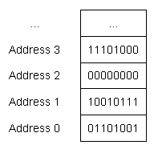

# Mastering-Low-level-Language
Learning Path to C &amp; C++ Programming | With Gun


# Basic


## Data

In computing we need to reading, changing, and writing data. **Data** is any information that can be moved, processed, or stored by a computer. 


## Program

To interact with the data in computer we need a program that can acquire data from :

1. From a Database
2. From a Network
3. From a Keyboard
4. From a Program itself (hardcoded)


## Object & Variable

A Program need memory to run, **RAM** (Random Access Memory) is used by the program. We can think RAM as a series numbered homes that each homes can be used to hold data while the program is running. 

Stored data in the memory is called value and to access memory we need indirect way through an object. It's because direct access to memory in C++ is not allowed. Compiler and Operating System is responsible for the object creation.

So rather than we remember numbered home, we will use object to get the values then we can focus on using objects to store and retrieve values, and not have to worry about where in memory they’re actually being placed.

Objects can be named or unnamed (anonymous). 

A named object is called a **variable** and variable represent named region of memory. The name of the object is called an **identifier**, an identifier is also the name that a variable is accessed by.


## Variable Instantiation

Here's an example of variable :

```C++
int hello;
```

When the program is run it's on runtime mode, when the program is compiled it's called compile time. At the running time hello variable will be instantiated, instantiation mean object will be created and assigned a memory address. An instantiated object is sometimes also called an **instance**.


## Data Type

 A **data type** (more commonly just called a **type**) tells the compiler what type of value that will be stored to variable. Our variable **hello** was given type *int* to represent an integer value, so we can call hello as *integer variable*. 

Integer variable can only hold integer values.

A type tells the program how to interpret a value in memory.


## Assignment

After a variable has been defined, you can give it a value (in a separate statement) using the *= operator*. This process is called **copy assignment** (or just **assignment**) for short.

```c++
int score { 1.5 }; // error: not all double values fit into an int
```


## Initialization

When a variable is defined, you can also provide an initial value for the variable at the same time. This is called **initialization**. The value used to initialize a variable is called an **initializer**. Initialization gives a variable an initial value at the point when it is created. Assignment gives a variable a value at some point after the variable is created.

There are 4 basic ways to initialize variables in C++:

```c++
int a; // no initializer
int b = 1; // initializer after equals sign
int c( 2 ); // initializer in parenthesis
int d { 3 }; // initializer in braces
```

Here we’re assigning a number (1.5) that has a fractional part (the .5 part) to an integer variable. Copy and direct initialization would drop the fractional part, resulting in initialization of value 4 into variable *score*. However, with brace initialization, this will cause the compiler to issue an error (which is generally a good thing, because losing data is rarely desired). 

```c++
int score { 1.5 }; // error: not all double values fit into an int
```


### Initialize Multiple Variable

It is possible to define multiple variables *of the same type* in a single statement by separating the names with a comma:

```cpp
int a = 5, b = 6; // copy initialization
int c( 7 ), d( 8 ); // direct initialization
int e { 9 }, f { 10 }; // brace initialization (preferred)
```


# Data Types


## **Bits, bytes, and memory addressing**

The smallest unit of memory is a **binary digit** (also called a **bit**), which can hold a value of 0 or 1. You can think of a bit as being like a traditional light switch -- either the light is off (0), or it is on (1).

Memory is organized into sequential units called **memory addresses** (or **addresses** for short). Similar to how a street address can be used to find a given house on a street, the memory address allows us to find and access the contents of memory at a particular location.

In modern computer architectures, each memory address holds 1 byte of data. A **byte** is a group of bits that are operated on as a unit. The modern standard is that a byte is comprised of 8 sequential bits.

The following picture shows some sequential memory addresses, along with the corresponding byte of data:



Because all data on a computer is just a sequence of bits, we use a **data type** (often called a “type” for short) to tell the compiler how to interpret the contents of memory in some meaningful way. 

When you give an object a value, the compiler and CPU take care of encoding your value into the appropriate sequence of bits for that data type, which are then stored in memory (remember: memory can only store bits). For example, if you assign an integer object the value *65*, that value is converted to the sequence of bits `0100 0001` and stored in the memory assigned to the object.

Conversely, when the object is evaluated to produce a value, that sequence of bits is reconstituted back into the original value. Meaning that `0100 0001` is converted back into the value *65*.


## Fundamental Types

C++ comes with built-in support for many different data types. These are called **fundamental data types**, but are often informally called **basic types**, **primitive types**, or **built-in types**.

Here is a list of the fundamental data types, some of which you have already seen:

- Type Categories
  - Floating Point
    - float
    - double
    - long double
  - Integral
    - Boolean
    - Char
    - Integer
      - short
      - int
      - long
      - long long
  - Null Pointer
  - Void

### Integral Types

The terms `integer` and `integral` are similar, but have different meanings. An `integer` is a specific data type that hold non-fractional numbers, such as whole numbers, 0, and negative whole numbers. `Integral` means “like an integer”. Most often, `integral` is used as part of the term `integral type`, which includes all of the Boolean, characters, and integer types (also enumerated types.

`Integral type` are named so because they are stored in memory as integers, even though their behaviors might vary

C++ also supports a number of other more complex types, called *compound types*.

Most modern programming languages include a fundamental `string` type (strings are a data type that lets us hold a sequence of characters, typically used to represent text). In C++, strings aren’t a fundamental type (they’re a compound type).


## Void

**Void** means “no type”

Most commonly, *void* is used to indicate that a function does not return a value:

```C++
void writeValue(int x) // void here means no return value
{
    std::cout << "The value of x is: " << x << '\n';
    // no return statement, because this function doesn't return a value
}
```


## Object Size

Memory on modern machines is typically organized into byte-sized units, with each byte of memory having a unique address. 

Up to this point, it has been useful to think of memory as a bunch of cubbyholes or mailboxes where we can put and retrieve information, and variables as names for accessing those cubbyholes or mailboxes. The amount of memory that an object uses is based on its data type.

Because we typically access memory through variable names (and not directly via memory addresses), the compiler is able to hide the details of how many bytes a given object uses from us. When we access some variable *x*, the compiler knows how many bytes of data to retrieve (based on the type of variable *x*), and can handle that task for us.

Even so, there are several reasons it is useful to know how much memory an object uses.

First, the more memory an object uses, the more information it can hold.

A single bit can hold 2 possible values, a 0, or a 1:

| bit 0 |
| ----- |
| 0     |
| 1     |

2 bits can hold 4 possible values:

| bit 0 | bit 1 |
| ----- | ----- |
| 0     | 0     |
| 0     | 1     |
| 1     | 0     |
| 1     | 1     |

3 bits can hold 8 possible values:

| bit 0 | bit 1 | bit 2 |
| ----- | ----- | ----- |
| 0     | 0     | 0     |
| 0     | 0     | 1     |
| 0     | 1     | 0     |
| 0     | 1     | 1     |
| 1     | 0     | 0     |
| 1     | 0     | 1     |
| 1     | 1     | 0     |
| 1     | 1     | 1     |

To generalize, an object with *n* bits (where n is an integer) can hold 2n (2 to the power of n, also commonly written 2^n) unique values. Therefore, with an 8-bit byte, a byte-sized object can hold 28 (256) different values. An object that uses 2 bytes can hold 2^16 (65536) different values!

The size of the object puts a limit on the amount of unique values it can store -- objects that utilize more bytes can store a larger number of unique values.

Second, computers have a finite amount of free memory. Every time we define an object, a small portion of that free memory is used for as long as the object is in existence. Because modern computers have a lot of memory, this impact is usually negligible. However, for programs that need a large amount of objects or data (e.g. a game that is rendering millions of polygons), the difference between using 1 byte and 8 byte objects can be significant.


### Size of The Fundamental Types

You may be surprised to find that the size of a given data type is dependent on the compiler and/or the computer architecture!

C++ only guarantees that each fundamental data types will have a minimum size:

| Category       | Type        | Minimum Size | Note                  |
| -------------- | ----------- | ------------ | --------------------- |
| boolean        | bool        | 1 byte       |                       |
| character      | char        | 1 byte       | Always exactly 1 byte |
|                | wchar_t     | 1 byte       |                       |
|                | char16_t    | 2 bytes      |                       |
|                | char32_t    | 4 bytes      |                       |
| integer        | short       | 2 bytes      |                       |
|                | int         | 2 bytes      |                       |
|                | long        | 4 bytes      |                       |
|                | long long   | 4 bytes      |                       |
| floating point | float       | 4 bytes      |                       |
|                | double      | 4 bytes      |                       |
|                | long double | 4 bytes      |                       |

However, the actual size of the variables may be different on your machine (particularly int, which is more often 4 bytes).

Objects of fundamental data types are generally extremely fast.


### The sizeof Operator

In order to determine the size of data types on a particular machine, C++ provides an operator named *sizeof*. The **sizeof operator** is a unary operator that takes either a type or a variable, and returns its size in bytes. You can compile and run the following program to find out how large some of your data types are:

```C++
#include <iostream>

int main()
{
    std::cout << "bool:\t\t" << sizeof(bool) << " bytes\n";
    std::cout << "char:\t\t" << sizeof(char) << " bytes\n";
    std::cout << "wchar_t:\t" << sizeof(wchar_t) << " bytes\n";
    std::cout << "char16_t:\t" << sizeof(char16_t) << " bytes\n";
    std::cout << "char32_t:\t" << sizeof(char32_t) << " bytes\n";
    std::cout << "short:\t\t" << sizeof(short) << " bytes\n";
    std::cout << "int:\t\t" << sizeof(int) << " bytes\n";
    std::cout << "long:\t\t" << sizeof(long) << " bytes\n";
    std::cout << "long long:\t" << sizeof(long long) << " bytes\n";
    std::cout << "float:\t\t" << sizeof(float) << " bytes\n";
    std::cout << "double:\t\t" << sizeof(double) << " bytes\n";
    std::cout << "long double:\t" << sizeof(long double) << " bytes\n";

    return 0;
}
```

Here is the output from the author’s x64 machine, using Embarcadero Dev C++ 6.3 :

```
bool:           1 bytes
char:           1 bytes
wchar_t:        2 bytes
char16_t:       2 bytes
char32_t:       4 bytes
short:          2 bytes
int:            4 bytes
long:           4 bytes
long long:      8 bytes
float:          4 bytes
double:         8 bytes
long double:    16 bytes
```

Your results may vary if you are using a different type of machine, or a different compiler. Note that you can not use the *sizeof* operator on the *void* type, since it has no size (doing so will cause a compile error).

You can also use the *sizeof* operator on a variable name:

```c++
#include <iostream>

int main()
{
    int x{};
    std::cout << "x is " << sizeof(x) << " bytes\n";

    return 0;
}
```

Output :

```
x is 4 bytes
```

